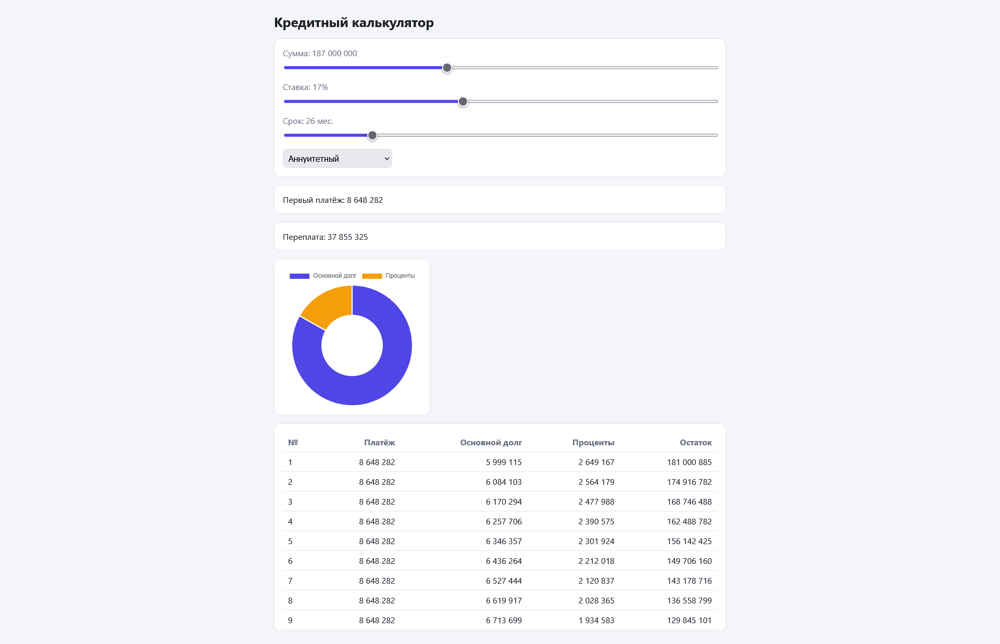

# Кредитный калькулятор

Калькулятор аннуитетных и дифференцированных платежей с графиком и таблицей.

**Демо:** https://loan-calc-rho-vert.vercel.app/?amount=50000000&rate=24&months=36&type=annuity


## Возможности

- Расчёт аннуитетного и дифференцированного платежа
- Таблица графика платежей (основной долг, проценты, остаток)
- График соотношения долга и процентов
- Параметры расчёта хранятся в URL, ссылкой можно поделиться
- Unit-тесты на логику расчёта

## Стек

React, TypeScript, Vite, Chart.js, Vitest

## Запуск

```bash
npm install
npm run dev
npm test
```

## Структура

- `src/lib/calc.ts` — чистые функции расчёта, отдельно от UI
- `src/hooks/useUrlState.ts` — синхронизация состояния с URL
- `src/components/` — форма, таблица, график